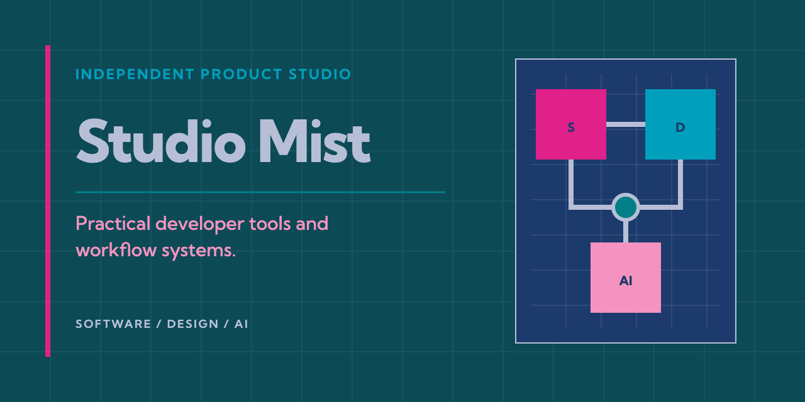

# Studio Mist

**Practical developer tools for better creative and technical work.**

Studio Mist is an independent product studio building practical developer tools and workflow systems at the intersection of software, design and AI.

The work combines hands-on engineering and product design with an artist's attention to clarity, composition and restraint. Each release starts with a real point of friction and turns it into a focused tool that is documented, testable and useful outside its original context.

## Current tools

### [Design Style Profiler](https://github.com/studiomistdev/design-style-profiler)

Build an evidence-based personal design guide from the work you use, keep, change and reject.

### [Writing Style Profiler](https://github.com/studiomistdev/writing-style-profiler)

Build and calibrate an evidence-based writing voice from your own emails, messages and documents.

### [Claude Rate Limit Guard](https://github.com/studiomistdev/claude-rate-limit-guard)

Protect Claude Code plan windows with local usage caching, clear warnings and approval-gated overrides.

## How Studio Mist builds

- Start with real workflow friction.
- Keep the tool focused enough to understand and adapt.
- Document setup, behaviour and trade-offs clearly.
- Test executable work, including failure paths and guardrails.
- Keep private data local wherever the problem allows it.
